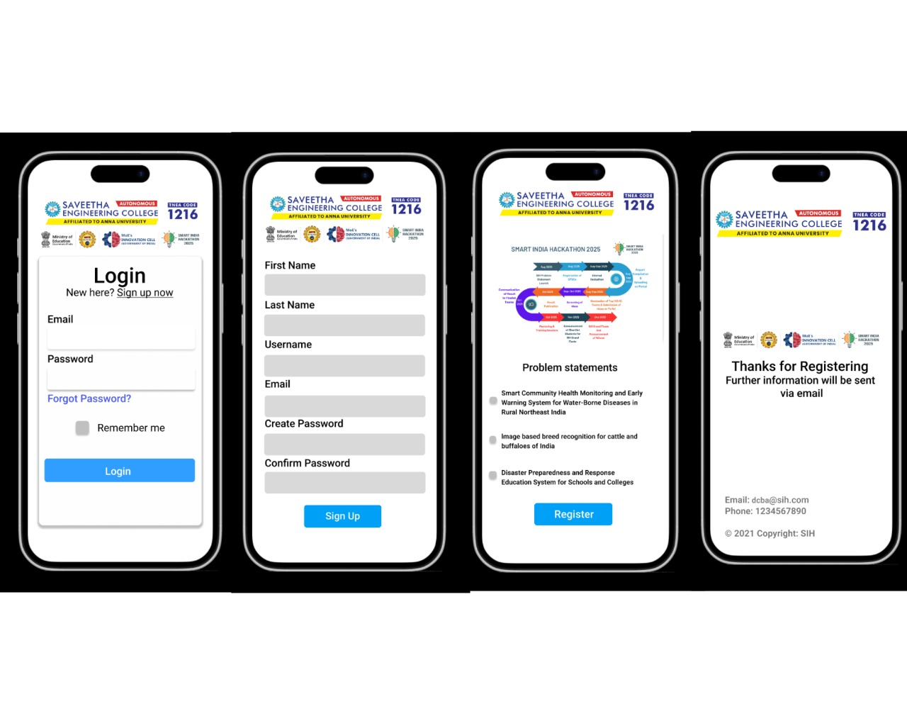

# Ex09 Event Registration Web Application
## Date:07-10-2025

## AIM:
To design, develop and deploy a web application for event registration.

## DESIGN STEPS:

### Step 1:
Create a new frame.

### Step 2:
Select any one preset size of your choice.

### Step 3:
Select the shapes you need.

### Step 4:
Import images as needed.

### Step 5:
Create pages based on your need and link them.

### Step 6:

Validate the HTML and CSS code.

### Step 6:

Publish the website in the given URL.

## DESIGN TOOL:
Figma

## CODE:
```
<div class="Login-Page"></div>
<div class="SIH2025-logo-1"></div>
<div class="Rectangle-1"></div>
<span class="Login-New-here-Sign-up-now">
  <span class="text-style-1">Login</span>
  New here?
  Sign up now
</span><span class="Email-Password-Forgot-Password">
  Email
<div class="Rectangle-2"></div>

Password
<div class="Rectangle-3"></div>
  <span class="text-style-1">Forgot Password?</span>
</span>
<span class="Remember-me">
  Remember me
</span>
<div class="Rectangle-4"></div>
<span class="Login">
  Login
</span>
```

## OUTPUT:


## RESULT:
The program to design, develop and deploy a web application for event registration is completed successfully.
